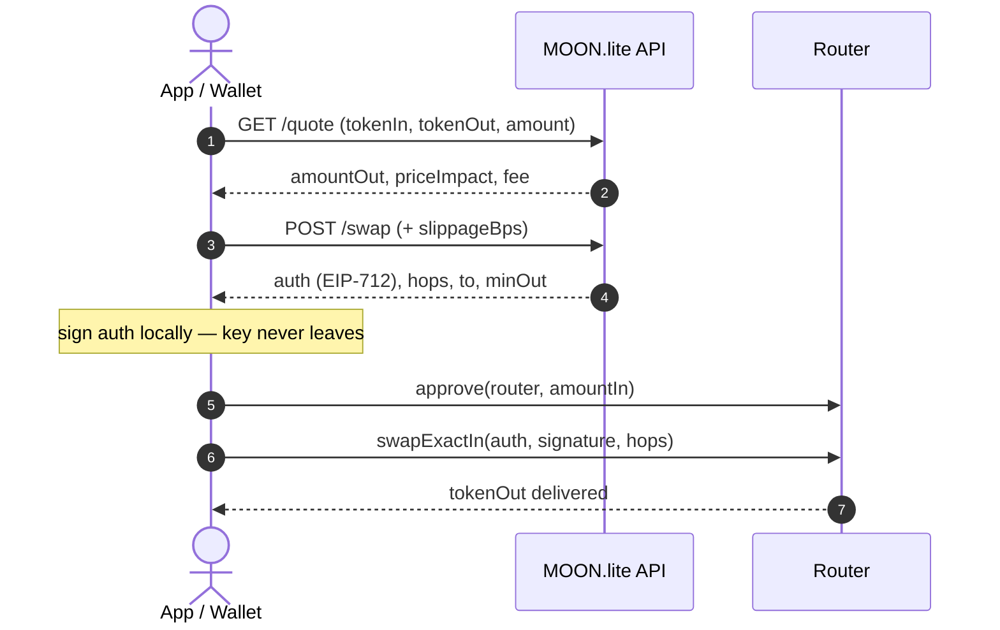
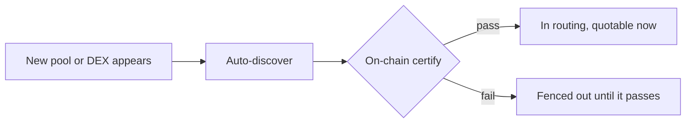

<div align="center">


# MOON.lite

<p><b>Best-execution router &amp; aggregator for the Arc blockchain.</b><br/>
One token in, one token out — the optimal path across every venue, settled in a single signed transaction.</p>

<p>


</p>

<p>
<a href="https://moonlite.so"><b>🌐 App</b></a> &nbsp;·&nbsp;
<a href="#-quick-start"><b>🔌 API</b></a> &nbsp;·&nbsp;
<a href="docs/API.md"><b>📖 API reference</b></a> &nbsp;·&nbsp;
<a href="docs/SIGNING.md"><b>✍️ Signing</b></a> &nbsp;·&nbsp;
<a href="examples/"><b>⚡ Examples</b></a>
</p>

</div>

> [!NOTE]
> **Live on Arc testnet** (chainId `5042002`). The quote &amp; swap plane is **fully public — no auth, no API key.** Every amount is an integer string in the token's own base units.

---

## ✨ Why MOON.lite

|   |   |
|---|---|
| ⚡ **Sub-millisecond quotes** | ~0.7 ms end-to-end across **45,153 pools**. |
| 🧭 **True best execution** | Multi-hop *and* multi-leg — one trade split across pools and chained across hops. |
| 🔎 **Self-expanding** | New DEXes and pools are **discovered and certified on-chain automatically** — tradable the moment they appear, no manual integration. |
| 🛡️ **Certified venues only** | Every venue passes a live on-chain adapter round-trip gate, so a quote you get back is a route that executes. |
| ✍️ **One signature** | The API returns a single EIP-712 order; your wallet signs locally — **keys never leave the client.** |
| 🎛️ **Your slippage** | `slippageBps` sets the on-chain `minOut` floor (default 2%). |
| ⚡ **Fast submit** | Hand us your signed swap for **accelerated broadcast** — faster inclusion, and you keep your gas. |

---

## ⚡ Quick start

Preview a price — public, no auth:

```bash
curl "https://api.moonlite.so/quote?tokenIn=0x3600000000000000000000000000000000000000&tokenOut=0xa4a3f16fc8c1494accd1ae9ebf33cc45bda02275&amount=1000000000000000000"
```

```jsonc
{ "amountOut": "399191495856262490842", "priceImpactBps": 0, "feeBps": 10 }
```

Ready to trade? Copy-paste a full **quote → sign → execute** client:

**[🟢 Node](examples/node)** &nbsp;·&nbsp; **[🐍 Python](examples/python)** &nbsp;·&nbsp; **[🦀 Rust](examples/rust)** — or grab an **agent-ready prompt** and Node / Python / Rust snippets straight from the app's **[integration panel](https://moonlite.so/#docs)**.

---

## 📐 How it works



1. **`approve`** — ERC-20 `approve(router, amountIn)` on `tokenIn`.
2. **`GET /quote`** — preview `amountOut`, price impact, and fee.
3. **`POST /swap`** — get a ready-to-sign `auth`, the `hops`, the router (`to`), and `netOut`. Pass **`slippageBps`** to set your `minOut` floor.
4. **Sign** — EIP-712 sign the `auth` with the user's wallet.
5. **`swapExactIn(auth, signature, hops)`** — submit to `to`, or `POST /submit` for **accelerated broadcast** (faster inclusion).

> [!TIP]
> **Slippage is one number.** Send `slippageBps` on `POST /swap` (`100` = 1%, `500` = 5%). The router floors `auth.minOut` by it — you never recompute a margin client-side. Omit it for the 2% default.

> [!CAUTION]
> **Never send your `privateKey` from a browser or wallet client.** The API only *builds* the plan; you sign the returned `auth` locally. (Passing `privateKey` to `/swap` is a backend-only convenience.)

---

## 🔎 Self-expanding coverage



MOON.lite indexes **45,153 pools** across **7 DEX families** spanning **34,196 tokens**:

| DEX family | Kind | Pools |
|---|---|--:|
| UniswapV2 forks | `v2` | 45,044 |
| UniswapV3 / concentrated | `v3` | 69 |
| Curve / StableSwap | `curve` | 31 |
| ArcDex | `arcdex` | 5 |
| Xylo | `xylo` | 2 |
| FixedPair | `fixedpair` | 1 |
| SwapArc | `swaparc` | 1 |
| **Total** | | **45,153** |

Every pool carries an on-chain **interface schema**, so the engine knows exactly how to read reserves and call the swap selector — no ABI drift, no guessing.

---

## 🚀 Performance

|   |   |
|---|---|
| **Median quote** | ~0.7 ms end-to-end (including the HTTP round-trip) |
| **Routing** | multi-hop, multi-leg — split across pools, chained across hops |
| **Certified venues** | **340+** live right now — see [`/health`](docs/API.md#get-health) |

<details>
<summary>Sample <code>GET /health</code> response</summary>

```json
{
  "ok": true,
  "service": "moonlite",
  "hot_count": 341,
  "certification": { "enforced": true, "pass": 428, "fail": 1, "hot_blocked_now": 1 },
  "iface_schema": { "certified": 45155, "mismatch": 0, "unknown": 1 }
}
```

</details>

---

## 🔀 Multi-hop & round-trip

`POST /swap` takes **`inputTokens[]`** and **`outputTokens[]`** arrays — swap `i` routes `inputTokens[i] → outputTokens[i]`, each hop feeding the next, all in **one** signed transaction.

> [!IMPORTANT]
> When the chain **ends where it began** (`outputTokens[last] == inputTokens[0]`), the order switches to **profit-only** mode: the router requires `netOut > amountIn`, so a cyclic route either lands in profit or reverts — never at a loss.

Full semantics in **[docs/API.md](docs/API.md#post-swap)**.

---

## 🧩 Integrate

Copy-paste a complete round-trip client — **quote → EIP-712 sign → `swapExactIn`** — from the app's **[integration panel](https://moonlite.so/#docs)**: switch **Node / Python / Rust**, or flip on **AI prompt** for an agent-ready spec to drop into Claude Code or Cursor.

| Language | Client | Library |
|---|---|---|
| 🟢 Node | [`examples/node`](examples/node) | `viem` |
| 🐍 Python | [`examples/python`](examples/python) | `web3.py` + `eth-account` |
| 🦀 Rust | [`examples/rust`](examples/rust) | `alloy` |

> [!TIP]
> Only `PRIVATE_KEY` is read from the environment (it's a secret). Every other knob — tokens, amount, `SLIPPAGE_BPS` — is a labeled constant at the top of each example.

---

## 🤝 Real-time feed & whitelabel bots

The `/quote` and `/swap` HTTP plane above is **public and needs no key**. Building a
whitelabel bot or a live-feed integration on top of MOON.lite? That real-time layer is
**key-gated**. Here's how onboarding works today:

1. **Register your integration** on the **[MOON.lite partners page](https://moonlite.so/partners.html)** — name, type, link, and your **payout address**. Submitting `POST`s to `/partners/register`, which records your integration as a **pending partner** (it returns `{"ok":true}`) and puts your payout address on the partner leaderboard.
2. **Self-serve feed-key issuance is not live yet.** Registering does not itself mint, deliver, or reveal a key — there is no shipped issue-and-deliver path. Until self-serve issuance ships, `ML_FEED_KEY`s are **provisioned directly by MOON.lite** for operators running a real integration. Register first, then coordinate with MOON.lite for a key.
3. Once you have a key, set it as the `ML_FEED_KEY` environment variable for the widget or bot. It is a secret — never placed in a URL or query string.

The open-source **[whitelabel Telegram + Discord bot](https://github.com/Operative-001/moonlite-bot)** reads that same `ML_FEED_KEY` from the environment.

---

## 🌐 Network

|   |   |
|---|---|
| **Chain** | Arc testnet |
| **chainId** | `5042002` (`0x4cef52`) |
| **Router** (EIP-712 `verifyingContract` + submit target) | `0xFECBFfCa1394545d3fe6620DFA4Fd3C8E3754E4B` |
| **Base token** (native USDC, gas token) | `0x3600000000000000000000000000000000000000` |
| **Protocol fee** | 10 bps, applied and returned in every quote |
| **API base** | `https://api.moonlite.so` |
| **Wallet RPC** | `https://api.moonlite.so/rpc` |

---

## 📖 Documentation

- **[docs/API.md](docs/API.md)** — full endpoint reference: `/health`, `/quote`, `/swap`, `/tokens`, `/venues`.
- **[docs/SIGNING.md](docs/SIGNING.md)** — EIP-712 `SwapAuthorization` signing guide + router ABI.
- **[examples/](examples/)** — runnable clients: [Node](examples/node) · [Python](examples/python) · [Rust](examples/rust).
- **[CHANGELOG.md](CHANGELOG.md)** — release history.

<details>
<summary>❓ FAQ</summary>

**Do I need an API key?** Not for trading — `/quote` and `/swap` are public. Only `/venues` is gated, and you don't need it to trade. The **real-time feed + whitelabel bot** plane *is* key-gated. Register your integration at [moonlite.so/partners.html](https://moonlite.so/partners.html) with your payout address to get on the partner leaderboard; note that **self-serve `ML_FEED_KEY` issuance is not live yet** — feed keys are provisioned directly by MOON.lite for now.

**Where does slippage come from?** You set it — `slippageBps` on `POST /swap`. The router bakes it into the signed `minOut`.

**Does my private key ever touch the server?** Never. The API returns an unsigned `auth`; your wallet signs it locally.

**Which token is `amount` denominated in?** The first input token, in its base units (integer string).

</details>

---

## 📄 License

[MIT](LICENSE) — applies to the documentation and the sample client code in this repository.
