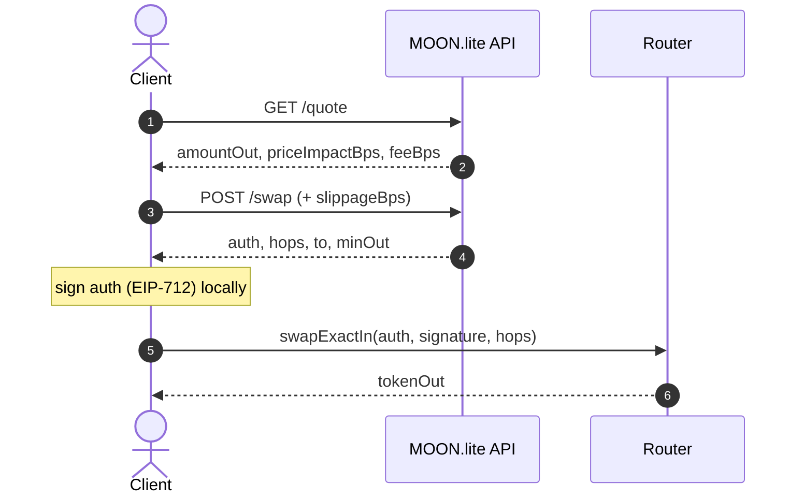

# MOON.lite — API Reference

The API base is `https://api.moonlite.so`. All examples target **Arc testnet** (chain `5042002`).

> [!NOTE]
> The **quote & swap plane is public** — no auth, no API key. Only `GET /venues` is
> Bearer-gated, and you don't need it to trade.



## Conventions

- **Amounts are integer base-unit strings** (wei-like), scaled by each token's own `decimals`. `1000000000000000000` is `1.0` of an 18-decimal token; `51065` is `0.051065` of a 6-decimal token. Amounts are strings to preserve `uint256` precision — never parse them as floats.
- **Addresses** are hex, `0x`-prefixed, and returned lower-cased.
- **Auth planes.** The **quote/swap plane is public** (`/quote`, `/swap`, `/tokens`, `/health`). The **venue directory (`/venues`) is Bearer-gated** — it is the private "what is tradable" listing; day-to-day clients do not need it and should use `/tokens` for the token selector.
- **Certification gate.** A venue can only enter a route after it passes a **live on-chain adapter round-trip certification**. Certification is enforced (see `/health`); uncertified or failing venues are blocked from quoting.
- **Fee.** A `10` bps (`feeBps: 10`) protocol fee is applied and reported transparently. On a swap it accrues to `feeRecipient` `0x088EF1AcBcc46a522Ab57190F89Fb002d68b38d7`.

---

## GET /health

Liveness and internal state: hot-venue count, certification stats, and interface-schema classification.

**Auth:** none.

```bash
curl "https://api.moonlite.so/health"
```

```json
{
  "ok": true,
  "service": "moonlite",
  "hot_count": 343,
  "certification": {
    "enforced": true,
    "pass": 419,
    "fail": 1,
    "hot_blocked_now": 1
  },
  "iface_schema": {
    "certified": 15779,
    "mismatch": 0,
    "unknown": 1,
    "backfill_classified": 15360
  }
}
```

| Field | Meaning |
|---|---|
| `ok` | Service healthy. |
| `service` | Always `"moonlite"`. |
| `hot_count` | Venues currently "hot" (warm and quotable). |
| `certification.enforced` | Whether the certification gate is enforced. |
| `certification.pass` / `fail` | Venues that passed / failed live on-chain round-trip certification. |
| `certification.hot_blocked_now` | Hot venues blocked right now for failing certification. |
| `iface_schema.certified` | Pools whose on-chain interface schema is confirmed. |
| `iface_schema.mismatch` / `unknown` | Pools whose schema mismatched / could not be classified. |
| `iface_schema.backfill_classified` | Pools classified during backfill. |

---

## GET /quote

Price preview for a single pair. **Public, no auth.**

**Query params:**

| Param | Required | Description |
|---|---|---|
| `tokenIn` | yes | Input token address. |
| `tokenOut` | yes | Output token address. |
| `amount` | yes | Integer base-unit string. For `ExactIn` (default) this is the input amount; for `ExactOut` it is the desired output amount. |
| `direction` | no | `ExactIn` (default) or `ExactOut`. |

### ExactIn (default)

```bash
curl "https://api.moonlite.so/quote?tokenIn=0x3600000000000000000000000000000000000000&tokenOut=0xa4a3f16fc8c1494accd1ae9ebf33cc45bda02275&amount=1000000000000000000"
```

```json
{
  "tokenIn": "0x3600000000000000000000000000000000000000",
  "tokenOut": "0xa4a3f16fc8c1494accd1ae9ebf33cc45bda02275",
  "direction": "ExactIn",
  "amount": "1000000000000000000",
  "amountIn": "1000000000000000000",
  "amountOut": "399191495856262490842",
  "priceImpactBps": 0,
  "feeBps": 10
}
```

### ExactOut

Specify the desired output; the API solves for the required input.

```bash
curl "https://api.moonlite.so/quote?tokenIn=0x3600000000000000000000000000000000000000&tokenOut=0xa4a3f16fc8c1494accd1ae9ebf33cc45bda02275&amount=100000000000000000000&direction=ExactOut"
```

```json
{
  "tokenIn": "0x3600000000000000000000000000000000000000",
  "tokenOut": "0xa4a3f16fc8c1494accd1ae9ebf33cc45bda02275",
  "direction": "ExactOut",
  "amount": "100000000000000000000",
  "amountIn": "51065",
  "amountOut": "100011946296479493012",
  "priceImpactBps": 0,
  "feeBps": 10
}
```

| Field | Meaning |
|---|---|
| `direction` | `ExactIn` or `ExactOut`. |
| `amount` | The amount you specified (input for `ExactIn`, output for `ExactOut`). |
| `amountIn` / `amountOut` | Resolved input and output, integer base-unit strings. |
| `priceImpactBps` | Estimated price impact in basis points (capped at `9999`). |
| `feeBps` | Protocol fee applied (`10`). |

**Errors** are returned as a plain-text body, e.g. `unknown tokenOut` when no route or unknown token.

---

## POST /swap

Build an executable, best-route swap and return a **ready-to-sign EIP-712 authorization**. **Public, no auth.**

**Body:**

| Field | Required | Description |
|---|---|---|
| `inputTokens` | yes | Array of input token addresses, one per hop. Single swap: `[tokenIn]`. Multi-hop: `[A, B, …]`. See [Multi-hop & round-trip routes](#multi-hop--round-trip-routes). |
| `outputTokens` | yes | Array of output token addresses, one per hop. `outputTokens[i]` is the target of hop `i` and should equal `inputTokens[i+1]`. Single swap: `[tokenOut]`. |
| `amount` | yes | Integer base-unit string (input amount). |
| `trader` | yes | The trader address (signer / owner of `tokenIn`). |
| `recipient` | no | Where output is delivered. Defaults to `trader`. |
| `deadline` | no | Unix seconds. The API sets a sane default if omitted. |
| `nonce` | no | Integer. Defaults to `0`. |
| `slippageBps` | no | Max price movement tolerated, in **basis points** (`100` = 1%, `500` = 5%). The router floors `auth.minOut` by it, clamped to `[10, 5000]` (0.1%–50%). **Default `200` (2%)** when omitted. |

> [!CAUTION]
> **`privateKey` is backend-only.** Adding `privateKey` to the body makes the **server** sign and additionally return `signature` + `calldata`. This is for backend/automation use only. **A browser or wallet client MUST omit `privateKey`** and sign the returned `auth` with the user's own wallet (see [SIGNING.md](SIGNING.md)).

```bash
curl -X POST "https://api.moonlite.so/swap" \
  -H "Content-Type: application/json" \
  -d '{
    "inputTokens": ["0x3600000000000000000000000000000000000000"],
    "outputTokens": ["0xa4a3f16fc8c1494accd1ae9ebf33cc45bda02275"],
    "amount": "1000000000000000000",
    "trader": "0x1111111111111111111111111111111111111111",
    "slippageBps": 500
  }'
```

```json
{
  "auth": {
    "trader": "0x1111111111111111111111111111111111111111",
    "tokenIn": "0x3600000000000000000000000000000000000000",
    "tokenOut": "0xa4a3f16fc8c1494accd1ae9ebf33cc45bda02275",
    "amountIn": "1000000000000000000",
    "minOut": "390816456271584736386",
    "feeBps": 10,
    "feeRecipient": "0x088ef1acbcc46a522ab57190f89fb002d68b38d7",
    "recipient": "0x1111111111111111111111111111111111111111",
    "deadline": "1787271748",
    "nonce": "0",
    "routeHash": "0x9e89d9716da011380bb0cee25f885b5ebb7eed007423d7bb165d8e769e03b58f",
    "swapMode": 0
  },
  "digest": "0x198ec2cbd347dbab9ed7b1f6b18f26e26a6f8eb22c315c7b37d1bb5e278e42fe",
  "grossOut": "399191493811755363921",
  "netOut": "398792302317943608558",
  "roundtrip": false,
  "to": "0xfecbffca1394545d3fe6620dfa4fd3c8e3754e4b",
  "hops": [
    {
      "tokenIn": "0x3600000000000000000000000000000000000000",
      "tokenOut": "0xf0c4a4ce82a5746abaad9425360ab04fbba432bf",
      "legs": [
        {
          "adapter": "0x3dbf811ab45f5b15235c92fa7f48fb4a62a93784",
          "amountIn": "144115187590193152",
          "data": "0x00000000000000000000000005eff4c5152178641b3e4a0bf07d797d2ad9a68f"
        }
      ]
    }
  ],
  "candidateHash": "0x7589ea366c6e750022fae60a8a6d40f5d8c26646fcf69393a1c8e25e4755ff90",
  "candidates": "0x0000..."
}
```

> The `hops` and `candidates` above are **truncated for readability** — a live response typically contains multiple hops, each with multiple `legs` (the router splits the trade across pools), and `candidates` is a long ABI-encoded blob. Pass `hops` back verbatim when submitting.

| Field | Meaning |
|---|---|
| `auth` | The **EIP-712 `SwapAuthorization` message** to sign. `amountIn`/`minOut`/`deadline`/`nonce` are decimal strings; `feeBps`/`swapMode` are numbers; `routeHash` is `bytes32`. See [SIGNING.md](SIGNING.md). |
| `digest` | The EIP-712 digest (32 bytes) that will be signed — useful to cross-check your client's typed-data hashing. |
| `grossOut` | Output before the protocol fee. |
| `netOut` | Output after the protocol fee — what the recipient receives. |
| `roundtrip` | Whether round-trip protection was applied to `minOut`. |
| `to` | The **router address** to submit to — also the EIP-712 `verifyingContract`. |
| `hops` | The route: an ordered list of hops, each `{tokenIn, tokenOut, legs[]}`; each leg is `{adapter, amountIn, data}`. Submit this verbatim. |
| `candidateHash` / `candidates` | ABI-encoded candidate graph for JIT best-route-at-execution via `swapCandidateGraph`. |

> [!TIP]
> **`auth.minOut` carries the slippage floor** the API computed from your **`slippageBps`** (default `200` = 2%) — pass the field to widen or tighten it; you don't recompute a margin client-side.

### Multi-hop & round-trip routes

`inputTokens` and `outputTokens` are **arrays**, evaluated pairwise: swap `i` routes
`inputTokens[i] → outputTokens[i]` via the engine's best split route, and the output of each
hop feeds the next. The whole chain returns as **one** `SwapAuthorization` + `hops` payload and
executes in a **single transaction**. `amount` is the input to the first hop only.

- **Single swap** — `inputTokens: [A]`, `outputTokens: [B]` routes `A → B`.
- **Chained multi-hop** — `inputTokens: [A, B]`, `outputTokens: [B, C]` routes `A → B → C`.
  Keep the chain contiguous: `outputTokens[i] == inputTokens[i+1]`.
- **Round trip (profit-only)** — when the chain ends where it began
  (`outputTokens[last] == inputTokens[0]`, e.g. `[A, B] / [B, A]`), the order is issued in
  **profit-only** mode (`swapMode: 1`): `minOut` is set to `amountIn`, so the router requires
  `netOut > amountIn` and the transaction **reverts rather than settle at a loss**. A non-cyclic
  route uses `swapMode: 0` with `minOut` = net output minus your `slippageBps` margin (default 2%).

The `roundtrip` boolean in the response reflects which mode was applied. Any hop may carry
multiple `legs` — the engine splits a hop across pools (water-filling) for best execution — so
submit the returned `hops` verbatim.

**Example — `A → B → C` in one signed transaction:**

```bash
curl -X POST "$API_BASE/swap" \
  -H "Content-Type: application/json" \
  -d '{
    "inputTokens":  ["0x3600000000000000000000000000000000000000", "0xf0c4a4ce82a5746abaad9425360ab04fbba432bf"],
    "outputTokens": ["0xf0c4a4ce82a5746abaad9425360ab04fbba432bf", "0xa4a3f16fc8c1494accd1ae9ebf33cc45bda02275"],
    "amount": "1000000000000000000",
    "trader": "0x1111111111111111111111111111111111111111"
  }'
```

`auth.tokenIn` is `inputTokens[0]`, `auth.tokenOut` is `outputTokens[last]`, and `hops`
describes the full ordered path. Sign and submit exactly as for a single swap.

---

## POST /submit

**Hyper-fast broadcast for an already-signed swap.** You build and sign the `swapExactIn` transaction yourself — your key, your gas, your nonce — then hand us the raw signed bytes and we put it on our **accelerated broadcast path**, so it reaches block production faster than a standard submission. We never sign anything and never touch your key.

> [!NOTE]
> Scoped to MOON.lite swaps: `/submit` only accepts a `swapExactIn` call to the router (`0xFECBFfCa1394545d3fe6620DFA4Fd3C8E3754E4B`). Anything else is rejected **before** broadcast.

**Body:**

| Field | Required | Description |
|---|---|---|
| `rawTx` | yes | The `0x`-prefixed, fully-signed transaction (legacy or EIP-1559). Its `to` must be the router and its calldata must be a `swapExactIn` call. |

```bash
curl -X POST "https://api.moonlite.so/submit" \
  -H "Content-Type: application/json" \
  -d '{"rawTx":"0x02f8b28227...<your signed swapExactIn tx>"}'
```

```json
{
  "ok": true,
  "txHash": "0xf1ac29f0..."
}
```

| Field | Meaning |
|---|---|
| `ok` | `true` if the transaction was accepted for broadcast. |
| `txHash` | The transaction hash (`keccak256` of the raw tx). |
| `error` | Present only when `ok` is `false` — a short reason. |

> [!TIP]
> **You pay your own gas** — `/submit` is pure fast broadcast, and the on-chain signature still authorizes the trade, so we can't alter it. Flow: `POST /swap` -> sign the `auth` (EIP-712) -> build + sign the `swapExactIn` transaction -> **`POST /submit`** instead of your wallet's own broadcaster. Faster inclusion = less price drift between quote and fill.

---

## GET /tokens

The on-chain-resolved token directory. **Public, no auth.** Use this for the **token selector** in a UI.

```bash
curl "https://api.moonlite.so/tokens"
```

```json
{
  "tokens": [
    { "address": "0xa4a3f16fc8c1494accd1ae9ebf33cc45bda02275", "symbol": "JUN", "name": "JUNbtc", "decimals": 18 },
    { "address": "0xc9a235abf48da9ad21205037bf790a1b120e6d7a", "symbol": "SNOD", "name": "Solar Noodle", "decimals": 18 },
    { "address": "0xf0c4a4ce82a5746abaad9425360ab04fbba432bf", "symbol": "cirBTC", "name": "Circle Wrapped Bitcoin", "decimals": 8 }
  ]
}
```

`symbol`, `name`, and `decimals` are resolved **on-chain** the first time a token is seen (384 tokens surfaced today). Arc exposes no on-chain token icons, so clients supply their own `logoURI` (from a token list) and fall back to a generated avatar when none is available.

---

## GET /venues

The gated venue directory — the private "what is tradable" listing. **Requires `Authorization: Bearer <API_AUTH_TOKEN>`.**

Most clients do **not** need this; the quote/swap plane is public and UIs should use `/tokens`.

```bash
curl "https://api.moonlite.so/venues" \
  -H "Authorization: Bearer $API_AUTH_TOKEN"
```

```json
{
  "venues": [ /* certified-tradeable venue descriptors */ ],
  "base_token": "0x3600000000000000000000000000000000000000"
}
```

Without a valid bearer token the endpoint responds `401` with body `unauthorized`.

---

## See also

- **[SIGNING.md](SIGNING.md)** — EIP-712 `SwapAuthorization` signing guide and router ABI.
- **Examples** — [Rust](../examples/rust) · [Python](../examples/python) · [Node](../examples/node).
